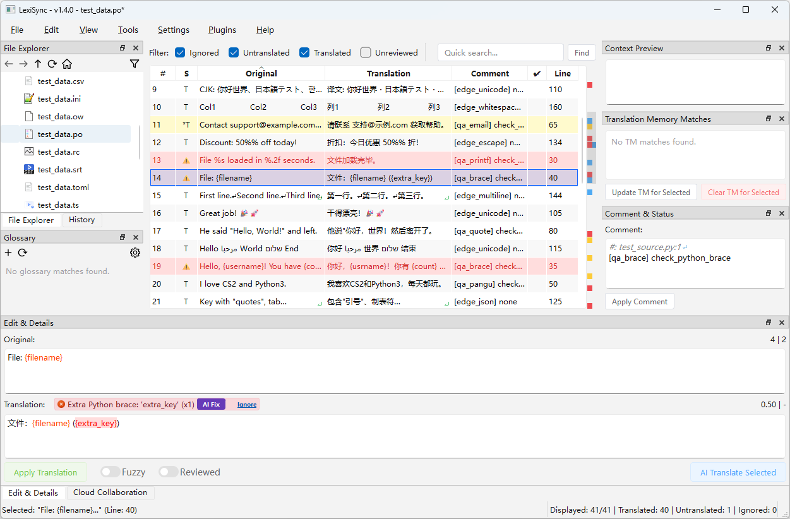
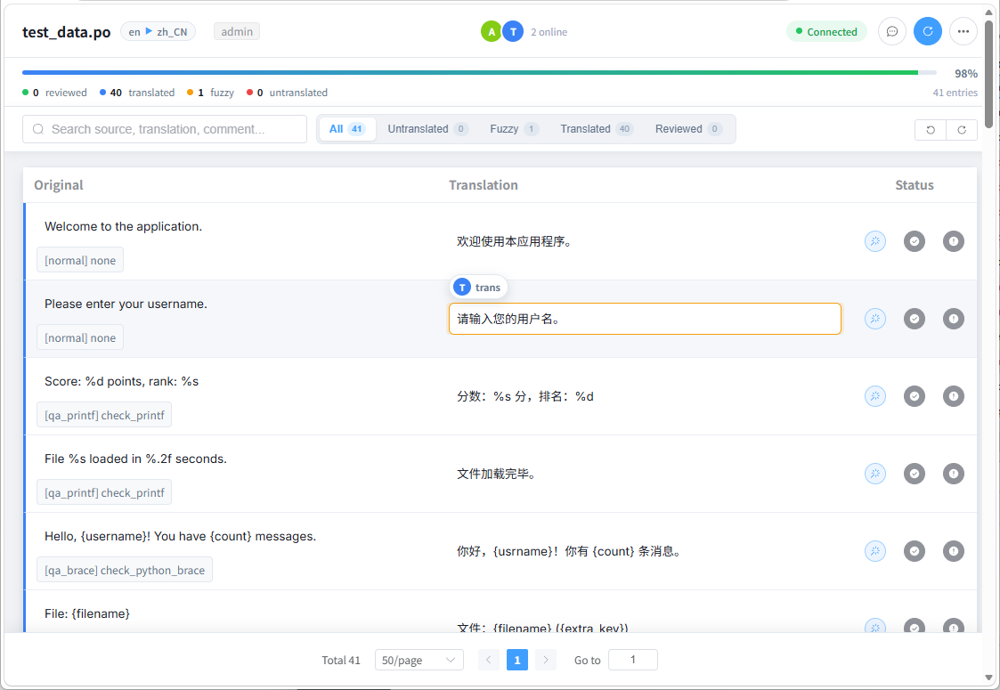
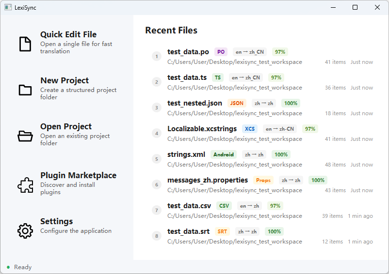
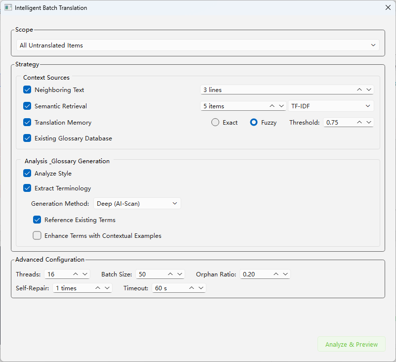
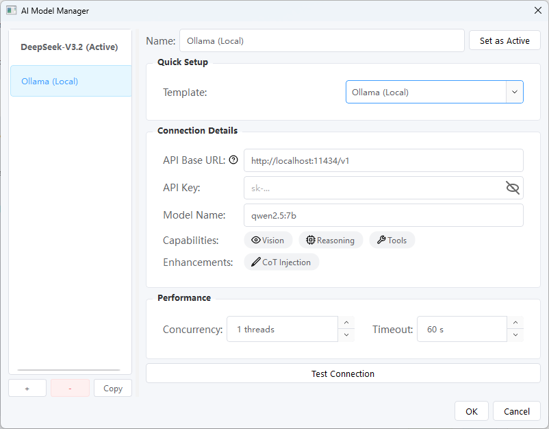
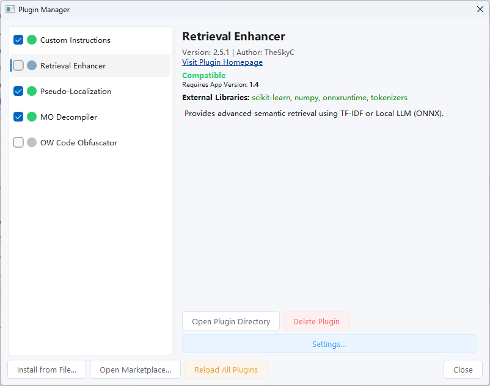

<div align="center">


</div>
<p align="center"><a href="../README.md">English</a> | 中文 | <a href="./README.ja.md">日本語</a><br></p>

# LexiSync
**LexiSync** 是一款面向开发者、翻译者和团队的下一代本地化协作平台。它将强大的桌面端性能与实时的 Web 云端协作无缝结合，提供了一套从文本提取、AI 辅助翻译、质量保证到多端同步的完整解决方案。

无论是个人开发者快速处理代码中的字符串，还是分布式团队协作翻译复杂的多语言项目，LexiSync 都能显著简化您的工作流程。

---

## 📥 下载
您可以从 **[GitHub Releases](https://github.com/TheSkyC/LexiSync/releases/latest)** 页面下载适用于 Windows、macOS 和 Linux 的最新版本。

[](https://github.com/TheSkyC/LexiSync/releases/latest)

## 🚀 核心特性

### ☁️ 云端实时协作 (Cloud Collaboration)
*   **一键建站**：将您的本地项目一键作为服务器开放，团队成员可通过浏览器（Web UI）直接接入，无需安装任何客户端。
*   **多端实时同步**：翻译、状态（已审校/模糊）、注释的任何修改都会在毫秒级广播给所有在线成员。支持 Web 端协同撤销/重做。
*   **协同感知与防冲突**：实时显示其他成员正在编辑的条目（光标锁定）。内置 Myers 算法差异对比，优雅解决并发编辑冲突。
*   **内网穿透与安全**：原生集成 Cloudflare Tunnel，无需公网 IP 即可生成安全的公共访问链接。内置基于角色的权限控制 (RBAC)、细粒度作用域限制、IP 封禁和持久化审计日志。

### 📂 全面的格式支持 (25+ Formats)
*   **海量格式兼容**：原生支持超过 25 种行业标准、主流开发框架、多媒体及办公文档的本地化文件：
    *   **行业标准与桌面 UI**: `PO/POT`, `XLIFF`, `Qt TS`
    *   **移动端与跨平台**: `Android Strings (XML)`, `iOS/macOS (.strings, .stringsdict)`, `Xcode String Catalog (.xcstrings)`, `Flutter ARB`
    *   **数据序列化与配置**: `JSON`, `i18next JSON`, `YAML`, `TOML`, `INI`
    *   **桌面与后端开发**: `Java .properties`, `.NET RESX`, `PHP Array`, `Windows RC`
    *   **表格与批量处理**: `CSV`, `Excel (.xlsx)`
    *   **多媒体与字幕**: `SRT`, `VTT`
    *   **网页与富文本办公文档**: `HTML`, `Markdown/MDX`, `Word (.docx)`, `PowerPoint (.pptx)`
    *   **自定义与特殊格式**: `Mozilla Fluent (.ftl)`, `OwCode(.ow)`
*   **原生复数支持**：支持各语言的复数规则（Zero/One/Two/Few/Many/Other），AI 翻译与验证引擎完全适配复数上下文。

### 🤖 AI 驱动的智能工作流
*   **智能批量翻译**：在翻译前对所有文本进行深度分析，自动生成**风格指南**、提取**关键术语**，并结合**翻译记忆 (TM)** 和**语义检索 (RAG)** 为 AI 提供丰富的上下文，大幅提升翻译质量和一致性。
*   **交互式审校模式**：一种全新的半自动工作流。AI 在后台预先翻译，用户只需在界面中逐条确认、修正或跳过，兼顾了效率与人工把控。
*   **自动化 QA**：输入时即时检测占位符丢失、标点不一致、首尾空格等错误；支持一键“自动修复”或“AI 修复”。

### 🖥️ 现代化的交互界面
*   **桌面端**：双轨道标记栏（直观显示错误、警告、搜索结果）、上下文实时预览、交互式历史记录面板。
*   **Web 端**：采用 Vue 3 构建的响应式界面，支持深色模式，以及内置的实时聊天抽屉。

## 📸 截图

*桌面端主界面*



*Web 端实时协作*



<details>
<summary><b>► 点击查看更多截图</b></summary>

*欢迎界面*



*智能批量翻译*



*AI模型管理界面*



*插件管理界面*



</details>

## 🛠️ 开发环境设置

### 前提条件
*   Python 3.12 或更高版本
*   Node.js 20.x 或更高版本 (用于构建 Web 前端)
*   Git (可选，用于克隆仓库)

### 步骤
1.  **克隆仓库 (或下载 ZIP)**
    ```bash
    git clone https://github.com/TheSkyC/LexiSync.git
    cd LexiSync
    ```

2.  **创建并激活虚拟环境 (推荐)**
    ```bash
    python -m venv venv
    # Windows
    .\venv\Scripts\activate
    # macOS/Linux
    source venv/bin/activate
    ```

3.  **安装 Python 依赖**
    ```bash
    pip install -r requirements.txt
    ```

4.  **构建 Web 前端**
    ```bash
    cd web_src
    npm ci
    npm run build
    cd ..
    ```

5.  **运行应用**
    ```bash
    python src/lexisync/main.py
    ```

## 🚀 快速上手

LexiSync 提供三种灵活的工作模式，以满足不同的使用场景：

### 1. ⚡ 快速编辑模式 (单文件)
*适用于单文件的快速修改、临时查看或轻量级任务。*
*   直接将单个文件（如 `.po`, `.json`, `.strings`）拖入主界面。
*   像往常一样利用 AI 辅助和术语提示进行翻译。
*   按 `Ctrl+S` 直接保存修改。

### 2. 📂 项目模式 (本地多文件)
*适用于多文件、多语言、需要长期维护和版本控制的大型项目。*
*   点击 `新建项目` (Ctrl+Shift+N)，批量拖入你的源文件。
*   在左侧文件浏览器中双击可在不同源文件间无缝切换。
*   确认无误后，点击 `文件 > 构建项目` (Ctrl+B)，程序会自动为所有目标语言生成翻译后的最终文件。

### 3. ☁️ 云协作模式 (团队多端)
*适用于需要多人同时翻译、审校的团队项目。*
*   在快速/项目模式下，打开底部的 **“云协作 (Cloud Collaboration)”** 面板。
*   点击 **“启动云服务”**。如果需要外网访问，在设置中勾选“启用公共 URL (内网穿透)”。
*   在“管理用户与权限”中为团队成员生成专属的访问 Token。
*   成员通过浏览器访问生成的链接，即可加入实时协作。

## 🌐 支持的语言
本工具支持对任意语言的翻译，并为以下语言的 UI 提供了本地化界面：
*   **English** (`en_US`)
*   **简体中文** (`zh_CN`)
*   **日本語** (`ja_JP`)
*   **한국어** (`ko_KR`)
*   **Français** (`fr_FR`)
*   **Deutsch** (`de_DE`)
*   **Русский** (`ru_RU`)
*   **Español (España)** (`es_ES`)
*   **Italiano** (`it_IT`)

## 🤝 贡献
欢迎任何形式的贡献！如果您有任何问题、功能建议或发现 Bug，请随时通过 GitHub Issues 提交。

## 📄 许可证
本项目基于 [Apache 2.0](../LICENSE) 开源，允许自由使用、修改和分发，但需保留版权声明。

## 📞 联系
- 作者：骰子掷上帝 (TheSkyC)
- 邮箱：0x4fe6@gmail.com